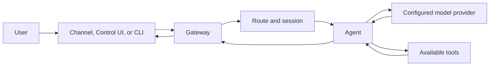

# NEER System Snapshot

This supplemental snapshot is not part of the main navigation. The canonical public overview is [NEER Architecture](/architecture); user-facing setup starts at [What is NEER?](/start/neer).

## Version and runtime

- Package: `neer`, version `0.0.1` (`package.json`).
- Runtime: Node.js `>=22.12.0` (`package.json`).
- Package manager: pnpm `10.23.0` (`package.json`).
- Main user interface: `neer` CLI, with a Gateway process and additional Control UI/companion clients.

These are repository metadata values, not release-support or deployment guarantees.

## Implementation map

| Subsystem            | Source                                                                 | Verified responsibility                                                                                             |
| -------------------- | ---------------------------------------------------------------------- | ------------------------------------------------------------------------------------------------------------------- |
| CLI                  | `src/cli/`, `src/commands/`                                            | Parses commands and performs setup, Gateway, agent, channel, and operational tasks.                                 |
| Configuration        | `src/config/`                                                          | Loads and validates `neer.json` configuration and environment overrides.                                            |
| Gateway              | `src/gateway/`                                                         | Hosts WebSocket and HTTP methods, enforces auth, starts integrations, and dispatches work. Default port is `18789`. |
| Routing and sessions | `src/routing/`, `src/sessions/`                                        | Resolves agent routes and manages conversation sessions.                                                            |
| Agent and tools      | `src/agents/`                                                          | Runs model turns, prepares context, exposes tools, and processes tool results.                                      |
| Providers            | `src/providers/`, provider extensions                                  | Integrates model and related service backends. A provider may be remote.                                            |
| Memory               | `src/memory/`, `extensions/memory-core/`, `extensions/memory-lancedb/` | Implements the configurable memory/search integrations; backends are not interchangeable assumptions.               |
| Channels and plugins | `src/<channel>/`, `src/plugins/`, `extensions/`                        | Implements built-in adapters and extension registration. Installed extensions may add capabilities.                 |
| Cognitive state      | `src/cognition/`                                                       | Stores drives, goals, experience records, and decision-loop state as separate code paths.                           |

## Request path



This diagram is a high-level summary. Provider support for streaming/tool calls, available tools, and message delivery behavior vary by the configured integrations.

## Cognitive and proactive behavior

The code wires two background behaviors during Gateway initialization:

1. The live proactive loop checks on a 10-second interval. It applies a production inactivity threshold, a cooldown, and intent/agent/cron guards before it can dispatch an agent request. The current source does not expose a separate documented configuration setting for stopping just this loop.
2. The pulse worker updates drives and goals and can dispatch background agent runs only when `NEER_AUTONOMOUS_MODE=true`. Its own execution is capped at three pulse ticks per hour. This environment flag does not disable the live proactive loop.

The functions exist in source; their presence does not establish reliable autonomous task completion, continuous learning, a guarantee of no unsolicited messages, or an operator-facing kill switch. Treat this subsystem as experimental and review the current code before unattended use.

## Claims not established by this repository snapshot

- Decentralized or peer-to-peer Gateway operation.
- One built-in SQLite vector database as the universal memory backend.
- A guarantee that prompts or integration data remain on the Gateway host.
- Continuous model training or durable learning from every conversation.
- A complete security assurance or formal verification of every path.

Each statement above is **Not verified in the current repository.**

## Development commands

The root `package.json` defines these representative commands:

```bash
pnpm install
pnpm build
pnpm tsgo
pnpm check
pnpm test
```

Documentation-specific checks are `pnpm check:docs`; the Mintlify local preview command is `pnpm docs:dev`.
