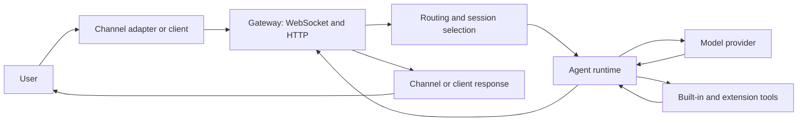
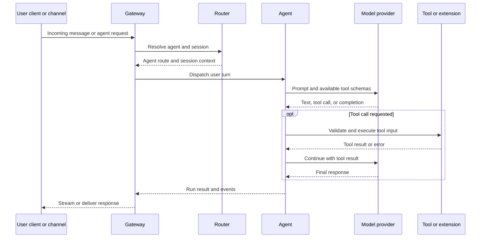

# NEER Architecture

This page summarizes the current implementation in the repository. The Gateway is the main process boundary: clients and channel adapters send work to it, it selects an agent and session, and the agent runtime coordinates model calls and tools. The Gateway is not a distributed control plane; remote access connects clients to a Gateway host.

## System flow

The exact path depends on the entry point. Channel messages pass through channel adapters and routing; Control UI and CLI requests use Gateway methods. Both paths can invoke the agent runtime. The [Gateway protocol](/gateway/protocol) describes the client handshake and frame types, and the [agent loop](/concepts/agent-loop) covers model/tool turns.

## Main components

| Component               | Repository locations                                                                                                          | Responsibility                                                                                                                                     |
| ----------------------- | ----------------------------------------------------------------------------------------------------------------------------- | -------------------------------------------------------------------------------------------------------------------------------------------------- |
| CLI and configuration   | `src/cli/`, `src/config/`, `src/commands/`                                                                                    | Command parsing, configuration loading, setup, and user-facing operations.                                                                         |
| Gateway                 | `src/gateway/`                                                                                                                | WebSocket and HTTP endpoints, authentication, request handlers, lifecycle, and channel startup. The default port is `18789`.                       |
| Routing and sessions    | `src/routing/`, `src/sessions/`                                                                                               | Selects an agent route and stores conversation/session state.                                                                                      |
| Agent runtime and tools | `src/agents/`                                                                                                                 | Builds agent runs, configures model/tool access, executes tool calls, and manages context.                                                         |
| Providers               | `src/providers/`, provider-related extensions                                                                                 | Model and service integrations. A configured provider may be remote.                                                                               |
| Memory                  | `src/memory/`, `extensions/memory-core/`, `extensions/memory-lancedb/`                                                        | Memory search and optional memory backends. The repository does not implement a single built-in SQLite vector store as the universal memory layer. |
| Channels                | `src/whatsapp/`, `src/telegram/`, `src/discord/`, `src/slack/`, `src/signal/`, `src/imessage/`, `src/web/`, and `extensions/` | Adapters for supported messaging systems. Availability depends on platform, credentials, and installed extensions.                                 |
| Plugin SDK              | `src/plugin-sdk/`, `src/plugins/`, `extensions/`                                                                              | Extension discovery, validation, registration, and plugin-provided capabilities.                                                                   |
| Companion applications  | `apps/neer-macos/`, `apps/neer-ios/`, `apps/neer-android/`, `apps/neer-desktop/`                                              | Platform-specific clients and companion features. Support differs by platform.                                                                     |

For end-user configuration, use the [configuration reference](/gateway/configuration-reference). For channel-specific status and setup, use [Channels](/channels). For plugin development, see [Plugin SDK](/refactor/plugin-sdk) and [plugin manifests](/plugins/manifest).

## Agent turn lifecycle

This is the common path, not a promise that every model supports tool calling or streaming. Provider capabilities and tool availability vary. The [provider overview](/providers) lists integrations; [built-in tools](/tools) documents the core tool families.

## Network and trust boundaries

- The Gateway multiplexes its WebSocket protocol and HTTP endpoints on its configured port. The default port is `18789`; development profiles use an isolated state directory and a shifted port.
- The default bind is loopback. Binding to a network interface changes who can reach the service; configure authentication and follow the [Gateway security guide](/gateway/security) before exposing it.
- Gateway authentication and device pairing are separate checks. See [authentication](/gateway/authentication) and [device pairing](/gateway/pairing).
- Agent prompts may be sent to the selected model provider. Tool calls may read or change local state, access network services, or send messages, depending on the enabled tools and policies.
- State is stored on the Gateway host according to the configuration and state-directory overrides. The repository does not guarantee that all inference, integrations, or backups stay on that host.

## Background cognition

The repository has two separate background paths wired during Gateway startup: a live proactive loop and a pulse worker. Their current behavior is implementation-specific and should be treated as experimental.

### Live proactive loop

`src/gateway/server.impl.ts` registers a callback that enters the normal agent message pipeline and calls `startCognitivePulse()`. The pulse module starts the live loop independently of its worker gate. The live loop checks every 10 seconds, applies an inactivity threshold (3 minutes in production), a 10-minute cooldown, and intent/agent/cron guards, then may invoke the registered agent callback. The source does not expose a separate documented configuration switch for disabling this live loop.

### Goal pulse worker

The worker handles drive updates, persistent goal records, stuck-goal recovery, and background agent runs. Pulse ticks are skipped unless the process environment contains `NEER_AUTONOMOUS_MODE=true`. When enabled, the worker schedules future pulses based on activity and caps its own executions at three per hour. This flag gates the worker; it does not gate the separate live proactive loop described above.

The goal and experience helpers are local JSON-backed components under `src/cognition/`; they are distinct from the configurable memory subsystem under `src/memory/`. The background prompts can request tools such as `create_goal`, `complete_goal`, `record_experience`, and `recall_experiences`, which are registered in the agent tool set. These mechanisms do not establish that NEER independently learns user preferences or guarantees completion of background goals.

<Warning>
Because the live proactive path starts with the Gateway and may dispatch a model request after its guards pass, operators should review this behavior before running an unattended Gateway. Setting `NEER_AUTONOMOUS_MODE` to a value other than `true` disables pulse-worker ticks only; it does not disable the live proactive loop.
</Warning>

## What the repository does not establish

- A decentralized or peer-to-peer Gateway mesh.
- A built-in, universal SQLite vector database for all memory.
- A guarantee that prompts, memory, or tool data never leave the Gateway host.
- Guaranteed autonomous completion of goals or continuous self-improvement.
- Identical capabilities across desktop, mobile, server, and extension builds.

For implementation-specific behavior, consult the corresponding [Gateway](/gateway), [sessions and memory](/concepts/memory), [providers](/providers), [tools](/tools), and [platforms](/platforms) pages.
