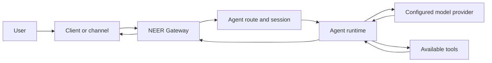

# NEER

**Cognitive Infrastructure** for running an AI assistant through a Gateway, agent sessions, model providers, tools, and messaging integrations.

NEER is a Node.js application that you can run on your own machine or server. Its `neer` CLI configures and operates a Gateway process. The Gateway connects supported clients and channel adapters to agent sessions. Depending on configuration, an agent can call model providers and tools, including optional extension tools.

The repository currently identifies package version `0.0.1` and credits Khalil Benhaya as designer and engineer. Feature availability varies by platform, provider, and installed extensions.

<CardGroup cols={2}>
  <Card title="Get started" icon="rocket" href="/start/getting-started">
    Install NEER, configure a Gateway, and start a first chat.
  </Card>
  <Card title="What is NEER?" icon="circle-help" href="/start/neer">
    Understand the runtime, integrations, and current limits.
  </Card>
  <Card title="Architecture" icon="network" href="/architecture">
    Follow a request from client or channel through the Gateway and agent runtime.
  </Card>
  <Card title="CLI reference" icon="terminal" href="/cli">
    Find command syntax and operational options.
  </Card>
</CardGroup>

## Request flow

The Gateway normally uses loopback binding and port `18789`. Remote access and non-loopback binds require deliberate network and authentication configuration. Review [Gateway security](/gateway/security) before exposing the service.

Model requests may go to an external provider. Running the Gateway on your own machine does not guarantee that inference or every integration stays local. See [model providers](/providers) and [memory](/concepts/memory) for the relevant configuration and limitations.

## Documentation sections

- [Installation](/install) — supported installation and deployment methods.
- [Channels](/channels) — built-in and extension-backed messaging integrations.
- [Agents](/concepts/agent) — sessions, context, routing, and execution.
- [Tools and skills](/tools) — built-in tools, plugins, and skill loading.
- [Models](/providers) — provider setup and model selection.
- [Gateway and operations](/gateway) — configuration, authentication, networking, and troubleshooting.
- [Development](/start/setup) — repository setup, build, lint, and development workflows.

## Repository facts

| Item            | Current repository metadata |
| --------------- | --------------------------- |
| Package         | `neer`                      |
| Version         | `0.0.1`                     |
| Node.js         | `>=22.12.0`                 |
| Package manager | pnpm `10.23.0`              |
| License         | MIT                         |

These values describe the checked-out repository metadata, not a promise about the latest published release. For the implementation map and distinctions between implemented, optional, and experimental behavior, see [NEER Architecture](/architecture).
