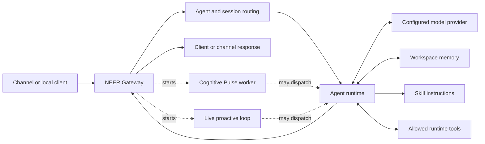

# NEER architecture

NEER is a Gateway process connected to configured agents, model providers, channel adapters, and client interfaces. The Gateway is the coordination and access point. Agent execution, provider inference, memory retrieval, tool execution, and background cognition are distinct parts of the runtime.

## Request flow

1. A channel adapter or local client submits a message or event to the Gateway.
2. NEER resolves the target agent and session using configuration and routing bindings.
3. The agent runtime assembles instructions and session context. Eligible skills provide instructions; memory tools can retrieve workspace notes when available.
4. The selected provider runs the model turn. The agent can call tools that are available under its effective tool and execution policies.
5. The result returns through the Gateway to the originating client or channel.

The path depends on the channel, agent, model, session state, and tool policy. Not every request retrieves memory or invokes a tool. A local Gateway can still send prompts, context, and media to a remote provider.

## Components

- **Cognitive Core:** Gateway-started goal and proactive runtime paths. The pulse worker is environment-gated; the separate live proactive loop starts with the Gateway. See [Cognitive Core](/neer-documentation/concepts/cognitive-core).
- **Agents:** identity, workspace, model choice, session context, and routing. See [Agents](/neer-documentation/concepts/agents).
- **Models:** configured provider/model choices for text and supported media tasks. See [Models](/neer-documentation/concepts/models).
- **Memory:** workspace documents and a searchable index exposed through memory tools. A separate JSON-backed experience store serves cognitive tools. See [Memory](/neer-documentation/concepts/memory).
- **Skills and tools:** instruction bundles and runtime operations available under the effective tool policy. See [Skills and Tools](/neer-documentation/concepts/skills-tools).
- **Gateway:** client access, channel coordination, health/status, and control operations. See [Gateway](/neer-documentation/concepts/gateway).
- **Channels:** adapters that connect messaging systems to Gateway routing. See [Channels](/neer-documentation/guides/channels).

## Deployment boundary

NEER can run on a local machine or host and connect to local or remote providers. Local-first describes where the Gateway can run; it does not guarantee that inference, embeddings, channel traffic, or backups remain on that host. Check the provider and channel configuration you use.

## Related

[Cognitive Core](/neer-documentation/concepts/cognitive-core) · [Security Overview](/neer-documentation/security/overview) · [Roadmap](/neer-documentation/roadmap/cognitive-roadmap)
