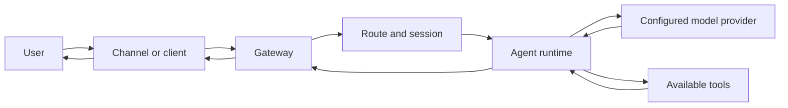

# What is NEER?

NEER is a self-hostable AI assistant runtime and control plane. The `neer` CLI configures and operates a Gateway process. That Gateway connects supported messaging channels and user interfaces to agent sessions, model providers, and tools.

The repository identifies the current package as version `0.0.1` and credits Khalil Benhaya as its designer and engineer. See the [architecture overview](/architecture) for the implementation map and its evidence.

## What runs where

- **Gateway host:** runs the Node.js process, loads configuration, serves the WebSocket and HTTP interfaces, and starts configured channel integrations.
- **Agent runtime:** selects a model and session, builds the request context, invokes available tools, and returns the result through the Gateway.
- **Clients and channels:** the CLI, Control UI, companion apps, and messaging adapters connect to the Gateway using their supported transports and authentication flows.
- **Extensions:** optional packages can add tools, providers, channels, or other plugin capabilities. An extension must be installed and enabled before its capability is available.

The Gateway normally binds to loopback and uses port `18789`; configuration and CLI options can change these values. A hosted model provider may receive prompts and related context, so running the Gateway on your own machine does not mean every part of inference stays local. Read [Gateway security](/gateway/security) and [model providers](/concepts/model-providers) before exposing the Gateway or selecting a provider.

## How a request moves through NEER

For the wire format and connection handshake, see the [Gateway protocol](/gateway/protocol). For the agent turn and tool loop, see [Agent loop](/concepts/agent-loop). For persistent conversation state, see [Sessions](/concepts/sessions).

## Background and proactive behavior

The repository contains a cognitive pulse worker and a separate live proactive loop. These are implemented code paths, but they should not be read as a guarantee of continuously autonomous behavior:

- The Gateway registers a proactive callback and starts the live loop during startup. It checks for eligible intents on a timer and applies inactivity, intent, and cooldown guards before invoking the normal agent pipeline.
- The pulse worker performs goal updates and may run background agent work only when the process has `NEER_AUTONOMOUS_MODE=true`. Without that variable, pulse ticks are skipped.
- `NEER_AUTONOMOUS_MODE` gates the pulse worker; it does **not** disable the separate live proactive loop in the current implementation.

The proactive path is implemented in `src/cognition/` and wired from `src/gateway/server.impl.ts`. It can cause agent activity without a new user message. Review [Cognitive architecture](/architecture#background-cognition) and [Gateway security](/gateway/security) before enabling an exposed or unattended deployment. The current repository does not document a separate configuration switch that disables only the live proactive loop.

## Start here

<CardGroup cols={2}>
  <Card title="Install NEER" icon="download" href="/install">
    Compare supported installation methods and their prerequisites.
  </Card>
  <Card title="Get started" icon="rocket" href="/start/getting-started">
    Configure a Gateway and open the Control UI for a first chat.
  </Card>
  <Card title="Configure the Gateway" icon="server" href="/gateway/configuration">
    Learn about ports, binding, authentication, and runtime configuration.
  </Card>
  <Card title="Use a model provider" icon="brain" href="/providers">
    Configure the inference provider and model used by an agent.
  </Card>
</CardGroup>

## Scope and limits

The source supports a Gateway, agent sessions, model integrations, tools, plugins, and multiple channel adapters. Specific features vary by platform and installation. The source does not establish that NEER is a distributed multi-tenant service, that all model inference is local, or that its memory layer is one unified SQLite vector database. Check the linked implementation pages for feature-specific requirements and limitations.
